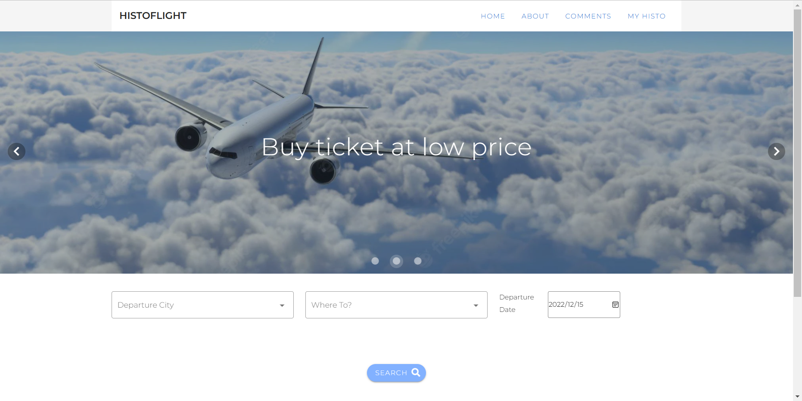
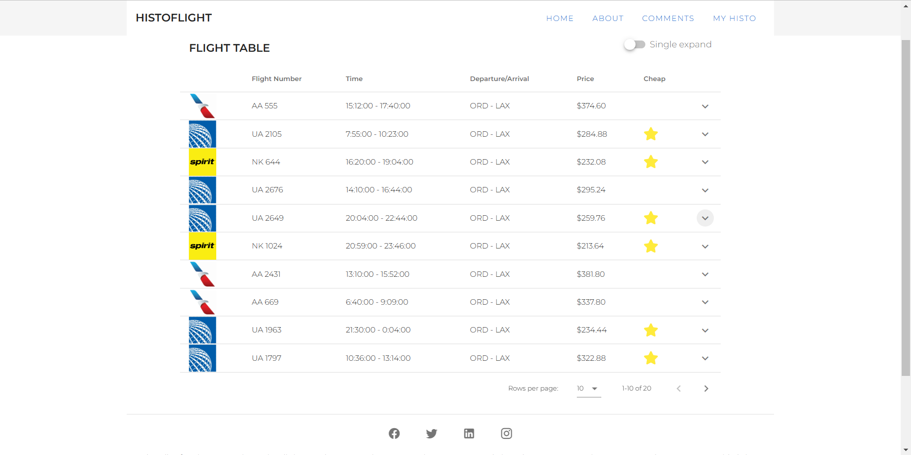
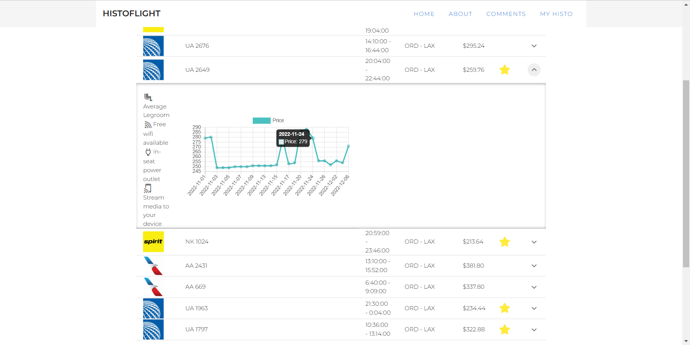
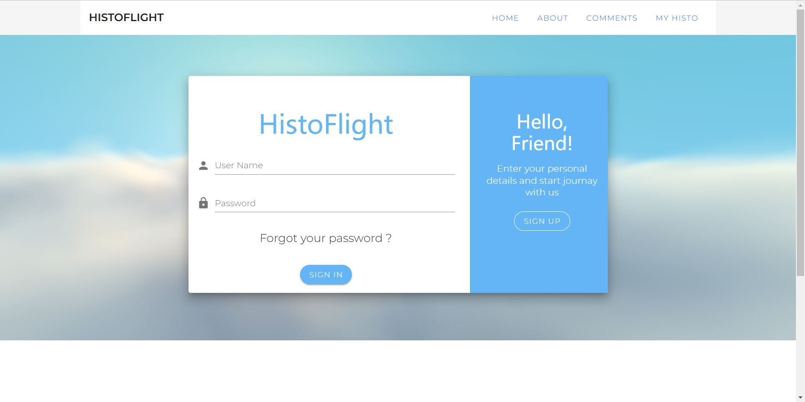
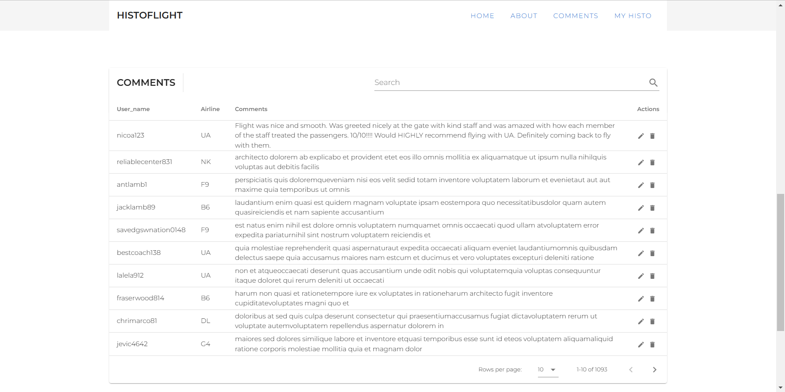

# HistoFlight
Web application: https://histoflight.fly.dev/#/

(Database service on GoogleCloud is not turned on (due to charges))

## Intro to our Web App
[YouTube link](https://youtu.be/BMpqUacX58w)

## Interface Demo
### Flight Search



### Login

###  Comments


## How To Use (if you want to run locally） 
Download [Docker](https://www.docker.com/)

Go to dockerfile directory
```
docker build . -t histoflight
docker run -p 8080:8080 histoflight
```
Open http://localhost:8080/#/
## Contributors
Yilun Fu

Weikun Wu

Henry Wang

Chengyan Ji
