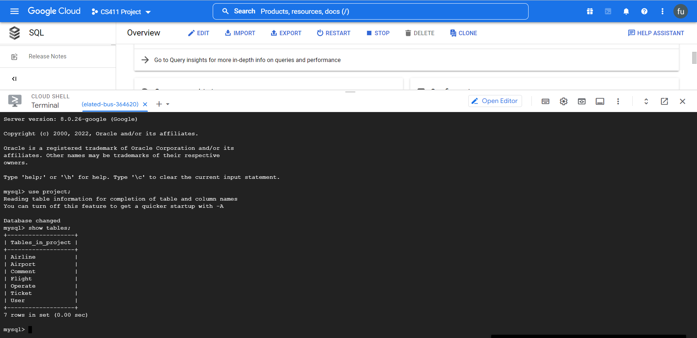
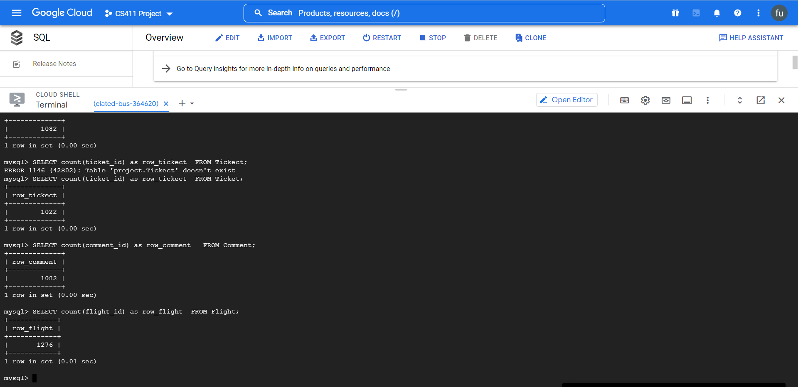
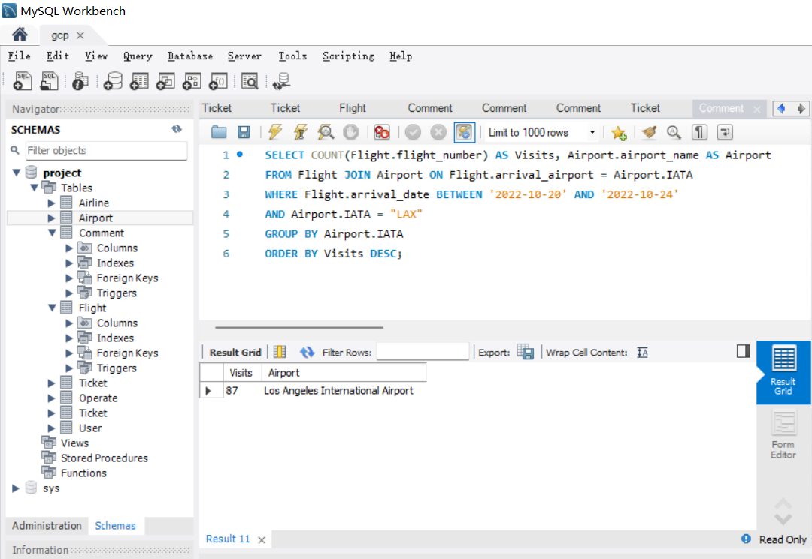
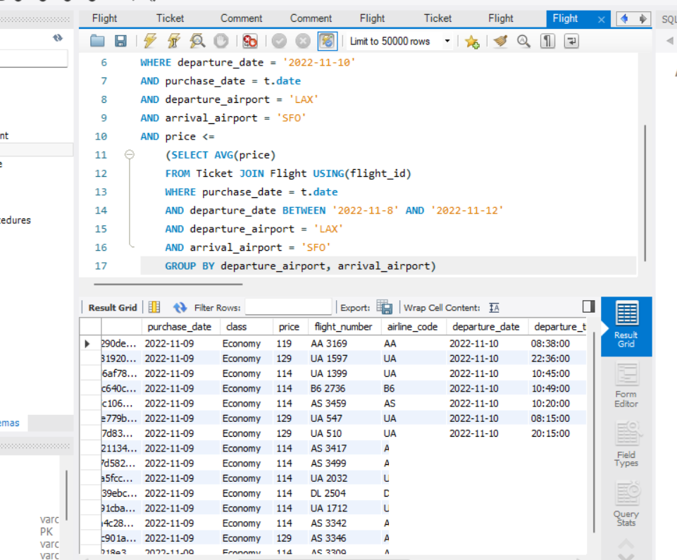
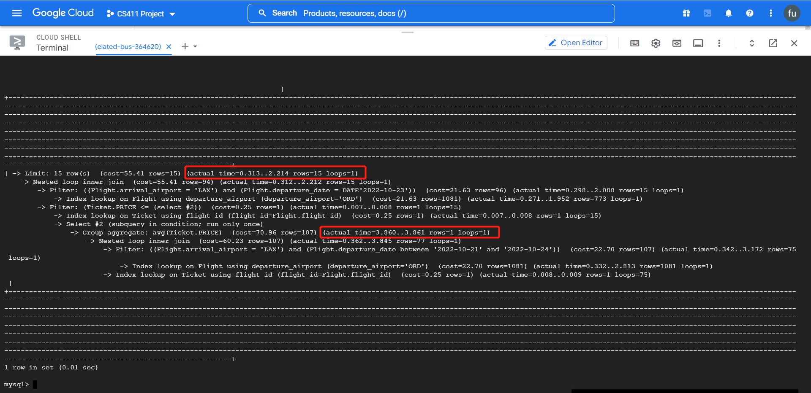
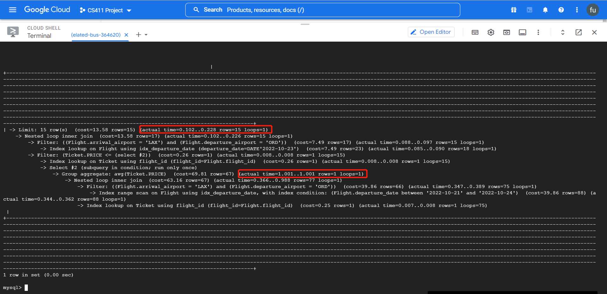

### Connection to GCP

### Data Definition Language
    -- create Airline table

    CREATE TABLE Airline (

        IATA VARCHAR(10) PRIMARY KEY,

        airline_name VARCHAR(100) NOT NULL

    );

    -- create Comment table

    CREATE TABLE Comment (

        comment_id VARCHAR(100) PRIMARY KEY,

        text TEXT,

        user_name VARCHAR(100) NOT NULL,

        airline VARCHAR(100) NOT NULL,

        FOREIGN KEY (user_name) REFERENCES User(user_name) ON DELETE CASCADE,

        FOREIGN KEY (airline) REFERENCES Airline(IATA) ON DELETE CASCADE

    );

    -- create User table

    CREATE TABLE User (

        user_name VARCHAR(100) PRIMARY KEY,

        password VARCHAR(100) NOT NULL,

        email VARCHAR(100),

        first_name VARCHAR(50),

        last_name VARCHAR(50)

    );

    -- create Ticket table

    CREATE TABLE Ticket (

        ticket_id VARCHAR(64) PRIMARY KEY,

        flight_id VARCHAR(64) NOT NULL,

        purchase_date DATE,

        class VARCHAR(50),

        price REAL,

        FOREIGN KEY (flight_id) REFERENCES Flight(flight_id) ON DELETE CASCADE

    );

    -- create Flight table

    CREATE TABLE Flight (

        flight_id VARCHAR(64) PRIMARY KEY,

        flight_number VARCHAR(30) NOT NULL,

        airline_code VARCHAR(10) NOT NULL,

        departure_date DATE,

        departure_time TIME,

        arrival_date DATE,

        arrival_time TIME,

        travel_time TIME,

        departure_airport VARCHAR(10),

        arrival_airport VARCHAR(10),

        FOREIGN KEY (airline_code) REFERENCES Airline(IATA) ON DELETE CASCADE,

        FOREIGN KEY (departure_airport) REFERENCES Airport(IATA) ON DELETE CASCADE,

        FOREIGN KEY (arrival_airport) REFERENCES Airport(IATA) ON DELETE CASCADE

    );

    -- create Operate table

    CREATE TABLE Operate (

        airline_IATA VARCHAR(10),

        airport_IATA VARCHAR(10),

        PRIMARY KEY (airline_IATA, airport_IATA),

        FOREIGN KEY (airline_IATA) REFERENCES Airline(IATA),

        FOREIGN KEY (airport_IATA) REFERENCES Airport(IATA)

    );
   
    -- create Airport table
    
    CREATE TABLE Airport (
    
        IATA VARCHAR(10) PRIMARY KEY,
        
        airport_name VARCHAR(50)
    );

### Show at least 1000 rows

### Advanced Query 1: get number of flights to a destination given a range of dates
    -- Compute the average price for a specific flight

    SELECT avg(price) as avg_price
            
    FROM Ticket JOIN Flight USING(flight_id)
    
    WHERE flight_id = '001a745f5f204000e30c3cb73ea5943b0fcd9b8aa10680a4f65ea0f7ec371e95'
    
    GROUP BY flight_id

    

### Advanced Query 2: get daily average flight price for each destination in a range of dates
    -- Find the average price for tickets bought on the last date of our available data, on flights departing from LAX to SFO
    from 2022-11-8 to 2022-11-12, and find all the flight information for flights that are cheaper than this average price

    SELECT *
    FROM Ticket JOIN Flight USING(flight_id), (
        SELECT MAX(purchase_date) as date
        FROM Ticket
    ) as t
    WHERE departure_date = '2022-11-10'
    AND purchase_date = t.date
    AND departure_airport = 'LAX'
    AND arrival_airport = 'SFO'
    AND price <=
        (SELECT AVG(price)    
        FROM Ticket JOIN Flight USING(flight_id)
        WHERE purchase_date = t.date
        AND departure_date BETWEEN '2022-11-8' AND '2022-11-12'
        AND departure_airport = 'LAX'
        AND arrival_airport = 'SFO'
        GROUP BY departure_airport, arrival_airport)
    

    

### EXPLAIN ANALYZE
#### Query 1
#### Before adding indexing

The cost of Index lookup on Flight using arrival_airport (arrival_airport='LAX') is 24.63 with scaning 1137 rows. The time to scan the first row is 0.297, and that turns to be 2.742 after finishing scanning all the rows.

#### Add index on arrival date from Flight

The cost of the total operation dropped significantly from 3 seconds to 0.4 seconds because of the added index on arrival_date. It now first filter the table by the arrival_airport, and then index range search on the arrival_date. Before, it must do a full table filter on arrival_date which is very costly without the indexing.

#### Add index on departure_date from Flight

#### Add index on flight_number from Flight

Adding index on departure_date or flight_number does not affect the query performance much since the query does not query on these columns

#### Query 2
#### Before adding indexing

The cost of the query took 6.765 seconds to complete. From the analysis, we see that the query is filter on non-indexed columns such as departure_date from Flight table and price from Ticket table. We could possibly add index to these columns to optimize the performance of our query.

#### Add index on departure date from Flight

The cost of the query drop from 6.765 seconds to 1.271 seconds. Having the index on departure_date increases the performance of filtering through this column.

#### Add index on price from Ticket

The cost of the query drop from 6.765 seconds to 2.214 seconds. Having the index on price enable it to quickly look for the rows that is cheaper than the average price.

#### Add index on both departure date from Flight and price from Ticket

The cost of the total operation dropped significantly from 6.765 seconds to 0.228 seconds because of the added index.

#### Conclusion

From the above analysis, we decide to apply index on departure date and arrival date from Flight, as well as price from Ticket since it yields a much better performance.
