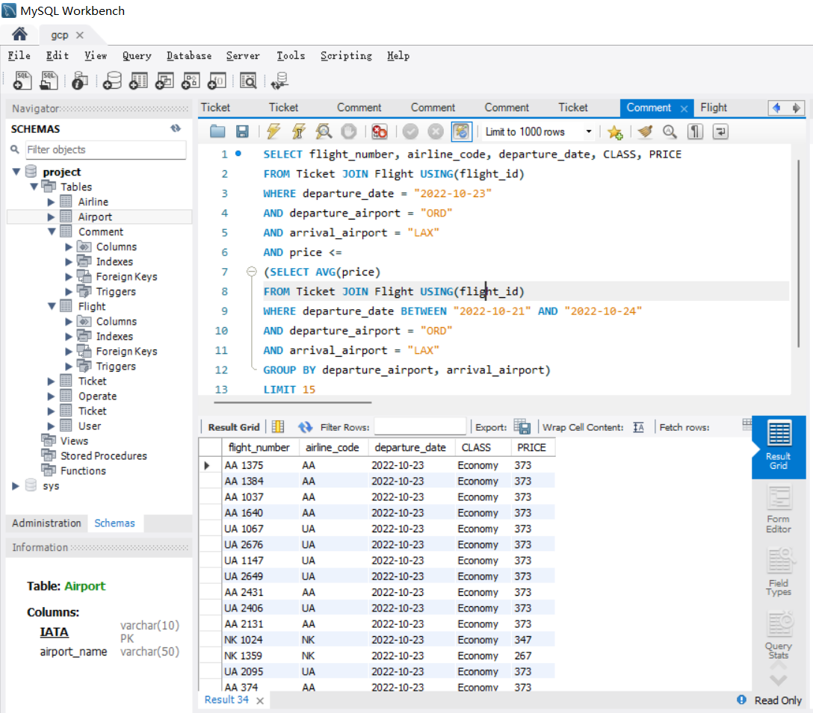
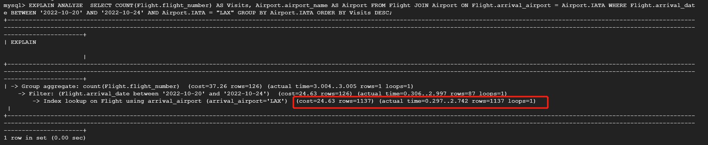
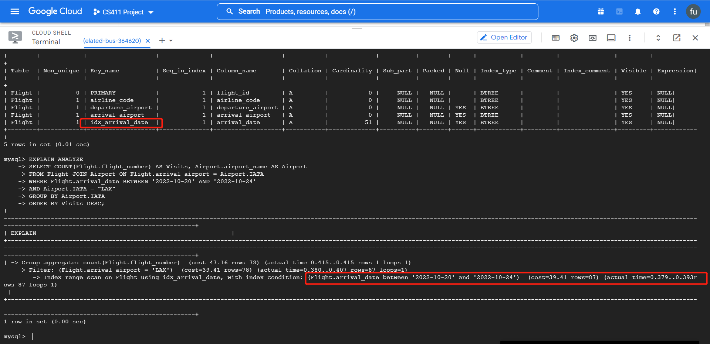
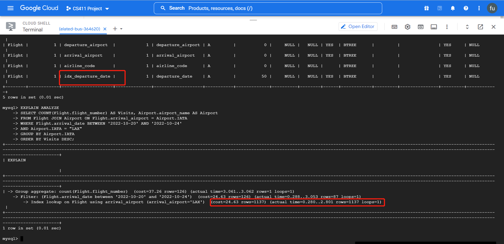
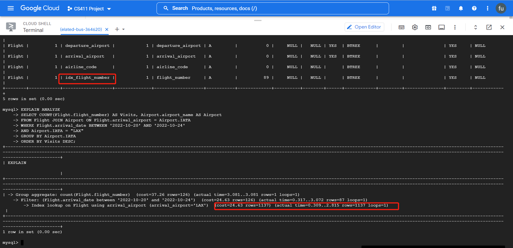

### Connection to GCP

### Data Definition Language
    -- create Airline table

    CREATE TABLE Airline (

        IATA VARCHAR(10) PRIMARY KEY,

        airline_name VARCHAR(100) NOT NULL

    );

    -- create Comment table

    CREATE TABLE Comment (

        comment_id INTEGER PRIMARY KEY,

        text TEXT,

        user_name VARCHAR(100) NOT NULL,

        airline VARCHAR(100) NOT NULL,

        FOREIGN KEY (user_name) REFERENCES User(user_name) ON DELETE CASCADE,

        FOREIGN KEY (airline) REFERENCES Airline(IATA) ON DELETE CASCADE

    );

    -- create User table

    CREATE TABLE User (

        user_name VARCHAR(100) PRIMARY KEY,

        password VARCHAR(100) NOT NULL,

        email VARCHAR(100),

        first_name VARCHAR(50),

        last_name VARCHAR(50)

    );

    -- create Ticket table

    CREATE TABLE Ticket (

        ticket_id VARCHAR(64) PRIMARY KEY,

        flight_id VARCHAR(64) NOT NULL,

        purchase_date DATE,

        CLASS VARCHAR(50),

        PRICE REAL,

        FOREIGN KEY (flight_id) REFERENCES Flight(flight_id) ON DELETE CASCADE

    );

    -- create Flight table

    CREATE TABLE Flight (

        flight_id VARCHAR(64) PRIMARY KEY,

        flight_number VARCHAR(30) NOT NULL,

        airline_code VARCHAR(10) NOT NULL,

        departure_date DATE,

        departure_time TIME,

        arrival_date DATE,

        arrival_time TIME,

        travel_time TIME,

        departure_airport VARCHAR(10),

        arrival_airport VARCHAR(10),

        FOREIGN KEY (airline_code) REFERENCES Airline(IATA) ON DELETE CASCADE,

        FOREIGN KEY (departure_airport) REFERENCES Airport(IATA) ON DELETE CASCADE,

        FOREIGN KEY (arrival_airport) REFERENCES Airport(IATA) ON DELETE CASCADE

    );

    -- create Operate table

    CREATE TABLE Operate (

        airline_IATA VARCHAR(10),

        airport_IATA VARCHAR(10),

        PRIMARY KEY (airline_IATA, airport_IATA),

        FOREIGN KEY (airline_IATA) REFERENCES Airline(IATA),

        FOREIGN KEY (airport_IATA) REFERENCES Airport(IATA)

    );
   
    -- create Airport table
    
    CREATE TABLE Airport (
    
        IATA VARCHAR(10) PRIMARY KEY,
        
        airport_name VARCHAR(50)
    );

### Show at least 1000 rows

### Advanced Query 1: get number of flights to a destination given a range of dates
    -- compute number of flights (from a certain airport) to a certain airport name given a range of dates; provides accessibility for user

    SELECT COUNT(Flight.flight_number) AS Visits, Airport.airport_name AS Airport

    FROM Flight JOIN Airport ON Flight.arrival_airport = Airport.IATA

    WHERE Flight.arrival_date BETWEEN '2022-10-20' AND '2022-10-24'
    
    AND Airport.IATA = "LAX"

    GROUP BY Airport.IATA

    ORDER BY Visits DESC;

    

### Advanced Query 2: get daily average flight price for each destination in a range of dates
    -- find all the flight information for ORD to LAX on 2022-10-23 whose price less than the average price in nearest 4 days(2022-10-21 to 2022-10-24)

    SELECT flight_number, airline_code, departure_date, CLASS, PRICE
    
    FROM Ticket JOIN Flight USING(flight_id)
    
    WHERE departure_date = "2022-10-23"
    
    AND departure_airport = "ORD"
    
    AND arrival_airport = "LAX"
    
    AND price <=
    
                (SELECT AVG(price)
                
                FROM Ticket JOIN Flight USING(flight_id)
                
                WHERE departure_date BETWEEN "2022-10-21" AND "2022-10-24"
                
                AND departure_airport = "ORD"
                
                AND arrival_airport = "LAX"
                
                GROUP BY departure_airport, arrival_airport)
                
    LIMIT 15
    

    

### EXPLAIN ANALYZE
#### Before adding indexing

The cost of Index lookup on Flight using arrival_airport (arrival_airport='LAX') is 24.63 with scaning 1137 rows. The time to scan the first row is 0.297, and that turns to be 2.742 after finishing scanning all the rows.

#### Add index on arrival date from Flight

The cost of the total operation dropped significantly from 3 seconds to 0.4 seconds because of the added index on arrival_date. It now first filter the table by the arrival_airport, and then index range search on the arrival_date. Before, it must do a full table filter on arrival_date which is very costly without the indexing.

#### Add index on departure_date from Flight

#### Add index on flight_number from Flight

Adding index on departure_date or flight_number does not affect the query performance much since the query does not query on these columns

